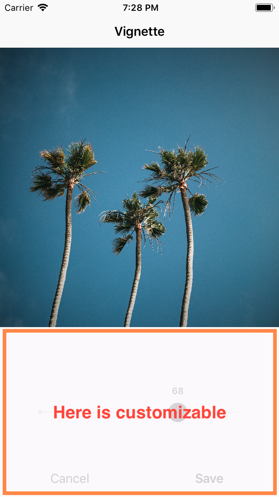

## ⚠️ v2 development is in progress. 

> 💥 Development for the next major version (v2) has started!
> Find out more [here](https://github.com/muukii/Pixel/pull/53), and if you're excited please hit the reaction button! 
>
> This update will obviously include many breaking changes. Feel free to start a discussion. I often upload movies of features in development to the pull-request's comments.
> 
> To use the stable version, please checkout the master branch.
> 

> 📌 Pixel needs a new name! Post your idea [here](https://github.com/muukii/Pixel/discussions/68). The leading name right now is **BrightRoom**?

---

# v2(WIP) Pixel - Composable image editor

Pixel v2 provides the following features:
- Components are built separately and run standalone using an `EditingStack`.
- Create your own image editor UI by composing components.
- `EditingStack` manages the history of editing and renders images. It's like a headless browser.

## Use Built-in fullstack image editor

- [ ] TODO

## Build your own cropping screen

CropView is a component that only supports cropping.


**UIKit**

```swift
let image: UIImage
let view = CropView(image: image)

let resultImage = view.renderImage()
```

**SwiftUI**

```swift
struct DemoCropView: View {
  let editingStack: EditingStack

  var body: some View {
    VStack {
      // ✅ Display a cropping view
      SwiftUICropView(
        editingStack: editingStack
      )
      // ✅ Renders a result image from the current editing.
      Button("Done") {
        let image: UIImage = editingStack.makeRenderer().render()
      }
    }
    .onAppear {
      editingStack.start()
    }
  }
}
```


---

# (v1) Pixel - Engine • Editor


Image editor and engine using CoreImage

## Support Muukii

Hi, I'm working on open-source software with a lot of time.
Please help me continue my work. I appreciate it.

https://github.com/sponsors/muukii

## In Production

- [eureka, Inc.](https://eure.jp)
   - Pairs
   - Pairs Engage

## Features

**Currently accepting PRs that impement these features.**

### Performance

* [x] ✈️Pretty Good
* [ ] 🚀Blazing Fast (🌀Anyone help us!)

### Adjustment

* [x] Crop
* [ ] Straighten (🌀Anyone help us!)
* [ ] Perspective (🌀Anyone help us!)

### Filter

#### Presets

* [x] ColorCube (Look Up Table)
  * [ ] Intensity

> ⚠️ Currently, Pixel does not contain LUT.
> Demo app has sample LUTs.

And also, here is [interesting article](https://medium.com/the-bergen-company/recreating-vsco-filters-in-darkroom-291114051a0e)

#### Edits

* [x] Brightness
* [x] Contrast
* [x] Saturation
* [x] Highlights
* [x] Shadows
* [x] Temperature
* [x] GaussianBlur
* [x] Vignette 
* [ ] Color (Shadows / Highlights)
* [x] Fade
* [x] Sharpen
* [x] Clarity
* [ ] HLS (🌀Anyone help us!)

#### Other

* [Restore editing](#restore-editing)
* [Customize Control-UI](#customize-control-ui)

## Requirements

* Swift 4.2 (Xcode10+)
* iOS 10+

## Getting Started

Demo.app contains the sample code.
Please check out `Sources/Demo/EditorViewController.swift`.

### Create instance of PixelEditViewController

```swift
let image: UIImage

let controller = PixelEditViewController(image: image)
```

### Show

* as Modal

⚠️ Currently we need to wrap the controller with `UINavigationController`. This is because `PixelEditViewController` needs a `UINavigationBar`.

```swift
let controller: PixelEditViewController

let navigationController = UINavigationController(rootViewController: controller)

self.present(navigationController, animated: true, completion: nil)
```

* as Push

We can push the controller in `UINavigationController`.

```swift
let controller: PixelEditViewController
self.navigationController.push(controller, animated: true)
```

### Setup Delegate

`PixelEditViewController` has delegate protocol called `PixelEditViewControllerDelegate`.

```swift
public protocol PixelEditViewControllerDelegate : class {
  func pixelEditViewController(_ controller: PixelEditViewController, didEndEditing editingStack: SquareEditingStack)
  func pixelEditViewControllerDidCancelEditing(in controller: PixelEditViewController)
}
```

💡`PixelEditViewController` does not know how to dismiss or pop by itself.
So we need to control `PixelEditViewController` outside.

Basically, it's like following code, recommend dismiss or pop in methods of delegate.

```swift
extension EditorViewController : PixelEditViewControllerDelegate {

  func pixelEditViewController(_ controller: PixelEditViewController, didEndEditing editingStack: SquareEditingStack) {

    self.navigationController?.popToViewController(self, animated: true)
  }

  func pixelEditViewControllerDidCancelEditing(in controller: PixelEditViewController) {
  
    self.navigationController?.popToViewController(self, animated: true)
  }

}
```

### Render Image


```swift
let editingStack: SquareEditingStack

let image = editingStack.makeRenderer().render(resolution: .full)
```

### Restore editing

We can take current editing as instance of `EditingStack` from `PixelEditViewController.editingStack`.

If we want to restore editing after closed `PixelEditViewController`, we use this.

```swift
let editingStack = controller.editingStack
// close editor

// and then when show editor again
let controller = PixelEditViewController(editingStack: editingStack)
```

### Add ColorCubeFilters

We can use LUT(LookUpTable) with CIColorCubeFilter.

LUT is like this (Dimension is 64)


```swift
import PixelEngine

let lutImage: UIImage

let filter = FilterColorCube(
  name: "Filter Name",
  identifier: "Filter Identifier",
  lutImage: lutImage,
  dimension: 64
)

let storage = ColorCubeStorage(filters: [filter])
let controller = PixelEditViewController(image: image, colorCubeStorage: storage)
```

And also, if we don't specify colorCubeStorage, use `default`.

```swift
// set
ColorCubeStorage.default.filters = filters

// get
ColorCubeStorage.default.filters
```

## Customize Control-UI

We can customize UI for control area.



### Customize Built-In Control-UI using override

There is `Options` struct in PixelEditor.
We can create options that fit our usecases.

So, If we need to change ExposureControl, override ExposureControlBase class.
Then set that class to Options.

```swift
var options = Options.default
options.classes.control.brightnessControl = MyExposureControl.self

let picker = PixelEditViewController(image: image, options: options)
```

It's like using custom Cell in UICollectionView.
If you have any better idea for this, please tell us💡.
And also Built-In UI may need expose some properties to customize from subclassing.

### Customize whole Control-UI

We can also customize whole UI.

Override `options.classes.control.rootControl`, then build UI from scratch.

For example, if you don't need the filter section but only the edit mode, you may want to create a control like: 
```swift
final class EditRootControl : RootControlBase {

   private let containerView = UIView()

   public let colorCubeControl: ColorCubeControlBase

   public lazy var editView = context.options.classes.control.editMenuControl.init(context: context)

   // MARK: - Initializers

   public required init(context: PixelEditContext, colorCubeControl: ColorCubeControlBase) {

       self.colorCubeControl = colorCubeControl

       super.init(context: context, colorCubeControl: colorCubeControl)

       backgroundColor = Style.default.control.backgroundColor

       layout: do {

           addSubview(containerView)

           containerView.translatesAutoresizingMaskIntoConstraints = false

           NSLayoutConstraint.activate([

               containerView.topAnchor.constraint(equalTo: containerView.superview!.topAnchor),
               containerView.leftAnchor.constraint(equalTo: containerView.superview!.leftAnchor),
               containerView.rightAnchor.constraint(equalTo: containerView.superview!.rightAnchor),
               containerView.bottomAnchor.constraint(equalTo: containerView.superview!.bottomAnchor)
           ])
       }
   }

   // MARK: - Functions

   override func didMoveToSuperview() {
       super.didMoveToSuperview()

       if superview != nil {
           editView.frame = containerView.bounds
           editView.autoresizingMask = [.flexibleWidth, .flexibleHeight]

           containerView.addSubview(editView)
       }
   }
}
```

And use it this way:

```swift
var options = Options.default
options.classes.control.rootControl = EditRootControl.self

let picker = PixelEditViewController(image: image, options: options)
```

### Filter some edit menu

If there are some edit options you don't need in your app, you can choose edit options you want to ignore:

```swift
var options = Options.default
options.classes.control.ignoredEditMenu = [.saturation, .gaussianBlur]
let controller = PixelEditViewController.init(image: UIImage(named: "large")!, options: options)
```

## Localization

Strings in UI can be localized with `L10n`.

```swift
import PixelEditor

PixelEditor.L10n.done = "保存"

// or
PixelEditor.L10n.done = NSLocalizedString...
```

## Installation

### CocoaPods

Pixel is available through [CocoaPods](https://cocoapods.org). To install
it, simply add the following line to your Podfile:

```ruby
pod 'PixelEngine'
pod 'PixelEditor'
```

### Carthage

For [Carthage](https://github.com/Carthage/Carthage), add the following to your `Cartfile`:

```ogdl
github "muukii/Pixel"
```

## Contributing

If you need more features, please open issue or submit PR!
Muukii may not know the approach to take for implementing them, So your PR will be very helpful.

### Development

To develop Pixel, setup environment of development with following code.

```ogdl
$ pod install
$ open Pixel.xcworkspace
```

## Author

Muukii (muukii.app@gmail.com)

## License

Pixel is available under the MIT license. See the LICENSE file for more info.


[](https://app.fossa.io/projects/git%2Bgithub.com%2Fmuukii%2FPixel?ref=badge_large)
